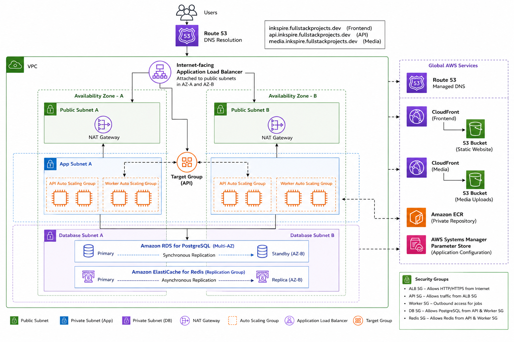

# Inkspire Infrastructure

> Production-grade AWS infrastructure for **Inkspire**, a full-stack blogging platform, built with **Terraform** using a modular Infrastructure as Code approach.

## Live Demo

* **Frontend:** https://inkspire.fullstackprojects.dev
* **API:** https://api.inkspire.fullstackprojects.dev

---
## Application Code

* **Frontend:** https://github.com/AyushShende25/blog-client
* **API:** https://github.com/AyushShende25/blog-api

---

# Project Overview

This repository provisions the complete production infrastructure required to deploy **Inkspire** on AWS.

The objective of this project was not simply to deploy an application, but to build a cloud environment that resembles how modern production systems are structured:

* Infrastructure as Code
* High Availability
* Private networking
* Secure communication between services
* Auto Scaling
* HTTPS everywhere
* CDN-backed frontend delivery
* Immutable application deployments using Docker

The infrastructure is fully modular and reusable, with each AWS service encapsulated inside its own Terraform module.

---

# Architecture



---

# AWS Services

| Service                         | Purpose                                 |
| ------------------------------- | --------------------------------------- |
| Amazon VPC                      | Isolated network                        |
| Public & Private Subnets        | Network segmentation                    |
| Internet Gateway                | Public connectivity                     |
| NAT Gateway                     | Outbound internet for private instances |
| Application Load Balancer       | Traffic distribution                    |
| Auto Scaling Groups             | High availability                       |
| Launch Templates                | EC2 configuration                       |
| Amazon EC2                      | API & worker compute                    |
| Amazon RDS PostgreSQL           | Primary database                        |
| Amazon ElastiCache Redis        | Cache & job queues                      |
| Amazon S3                       | Static website & media storage          |
| Amazon CloudFront               | Global CDN                              |
| Amazon ECR                      | Docker image registry                   |
| ACM                             | SSL certificates                        |
| Route53                         | DNS                                     |
| IAM                             | Least-privilege permissions             |
| Systems Manager Parameter Store | Runtime configuration                   |

---

# Infrastructure Highlights

## Networking

* Custom VPC
* Public and private subnet isolation
* Dedicated application and database tiers
* Multi-AZ deployment
* NAT Gateway for private outbound connectivity
* Internet-facing Application Load Balancer

---

## Compute

### API Layer

* Auto Scaling Group
* Launch Templates
* Docker-based deployment
* Private EC2 instances
* Load-balanced through ALB
* Health checks

### Worker Layer

* Dedicated Auto Scaling Group
* Private networking
* Background job processing
* Independent scaling

---

## Database

Amazon RDS PostgreSQL

* Multi-AZ deployment
* Automated backups
* Security-group restricted
* Private subnet deployment

---

## Caching

Amazon ElastiCache Redis

* Replication Group
* Automatic failover
* Encryption enabled
* Private networking

---

## Frontend Delivery

React SPA hosted on:

* Amazon S3
* CloudFront CDN
* HTTPS via ACM
* Custom domain through Route53

---

## Media Storage

Dedicated media pipeline:

* Amazon S3
* CloudFront CDN
* CORS enabled
* IAM restricted access

---

# Security

Security was designed around the principle of least privilege.

### Network Isolation

* Private application subnets
* Private database subnets
* No direct internet access to EC2
* Database accessible only by application security groups

### IAM

Application instances receive permissions through IAM Instance Profiles.

Capabilities include:

* Read Parameter Store
* Pull Docker images from Amazon ECR
* Upload media to S3

No long-term AWS credentials are stored on the instances.

### Runtime Configuration

Application configuration is stored in AWS Systems Manager Parameter Store.

Infrastructure-generated values such as:

* Database endpoint
* Redis endpoint
* Media bucket
* Client URL

are automatically provisioned during infrastructure deployment.

---

# Terraform Modules

```text
modules/
├── acm/
├── alb/
├── autoscaling/
├── cloudfront/
├── ecr/
├── elasticache/
├── iam/
├── launch-template/
├── parameter-store/
├── rds/
├── route53/
├── s3/
├── security-groups/
└── vpc/
```

Each module is independently reusable and encapsulates a single AWS service.

---

# Deployment Workflow

```text
Developer
    │
    ▼
Build Docker Image
    │
    ▼
Push Image → Amazon ECR
    │
    ▼
Launch Template
    │
    ▼
Auto Scaling Group
    │
    ▼
EC2 User Data
    │
    ▼
Pull Docker Image
    │
    ▼
Load Runtime Config
(Parameter Store)
    │
    ▼
Start Application
```
---

# Key Engineering Decisions

* Modular Terraform design instead of a monolithic configuration.
* Separate Auto Scaling Groups for API and worker services.
* Private EC2 instances behind an Application Load Balancer.
* Dedicated CloudFront distributions for frontend assets and media uploads.
* Parameter Store used for runtime configuration instead of baking configuration into AMIs.
* Docker-based deployments using Amazon ECR.
* TLS termination at the Application Load Balancer.
* Multi-AZ database deployment for resilience.

---

# Future Improvements

* GitHub Actions CI/CD pipeline
* Packer-built immutable AMIs
* Blue/Green deployments
* AWS WAF
* CloudWatch dashboards & alarms
* Secrets Manager integration
* ECS/Fargate deployment
* Automated AMI versioning

---

# Technologies

* Terraform
* AWS
* Docker
* Amazon Linux
* PostgreSQL
* Redis

